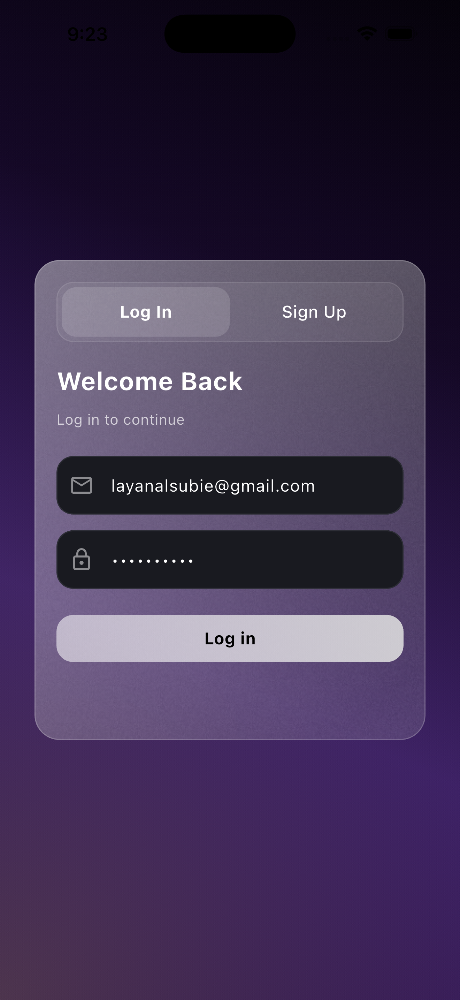
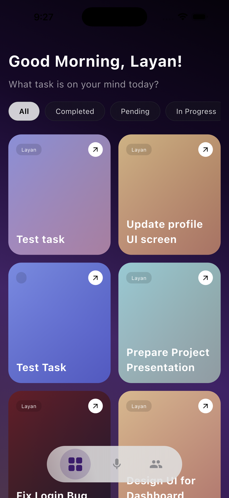
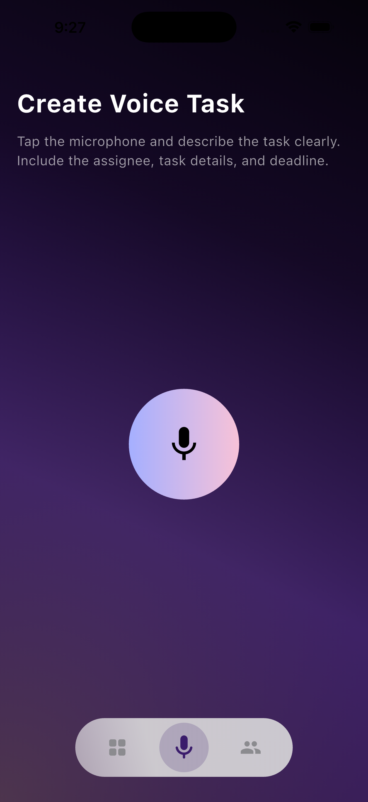

```md
# 🎤 VocaDo - Voice Task Manager

## 📌 Overview
VocaDo is a Flutter-based application that transforms voice input into structured tasks using AI.  
The app records voice, converts it into text using Gladia Speech-to-Text API, then analyzes it to generate organized tasks.

---

## 🚀 Features
- 🎙️ Voice recording  
- 🗣️ Speech-to-Text using Gladia API  
- 🧠 AI task extraction using Gemini  
- 📋 Automatic task generation  
- 🔗 Supabase integration  
- 📊 Task management (Pending / Done)  

---

## 📸 Screenshots





---

## 🎥 Demo


---

## 🛠️ Tech Stack
- Flutter & Dart  
- BLoC  
- Supabase  
- Dio  
- Gladia API  
- Gemini API  

---

## 📂 Project Structure
```

lib/
├── core/
├── features/
│   ├── voice_task/
│   ├── task_viewer/
│   └── ...
└── main.dart

```

---

## ⚙️ Setup

Install dependencies:
```

flutter pub get

```

Create `.env` file:
```

GLADIA_API_KEY=your_key
GEMINI_API_KEY=your_key
SUPABASE_URL=your_url
SUPABASE_ANON_KEY=your_key

```

Run the app:
```

flutter run

```

---

## 👩‍💻 Developers
- Amaal Alanazi  
- Layan Alsubaie  
```
